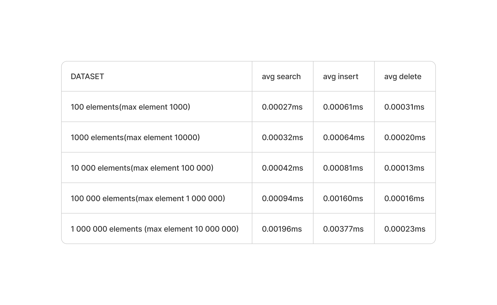
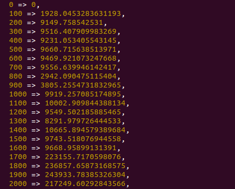

# Algorithms + Data Structures

## Binary Search Tree complexity

To check the measurements by yourself run the file `bstree/measurements.js` with different `MAX_ELEMENT`, `ELEMENTS` and `DATASETS`.

## Countung sort perfomance

To check the measurements by yourself run the file `counting_sort/measurements.js` with different `MAX_ELEMENTS` and `ELEMENTS_INCREMENT`.

We can see that we do have a perfomance spikes between 100 and 200, that is ~x5. And one more serious spike between 1400 and 1700 that is ~x20.

Perfomance of Countung sort is bad even at 200 elements, but after 1500 elements it's just a nightmare.